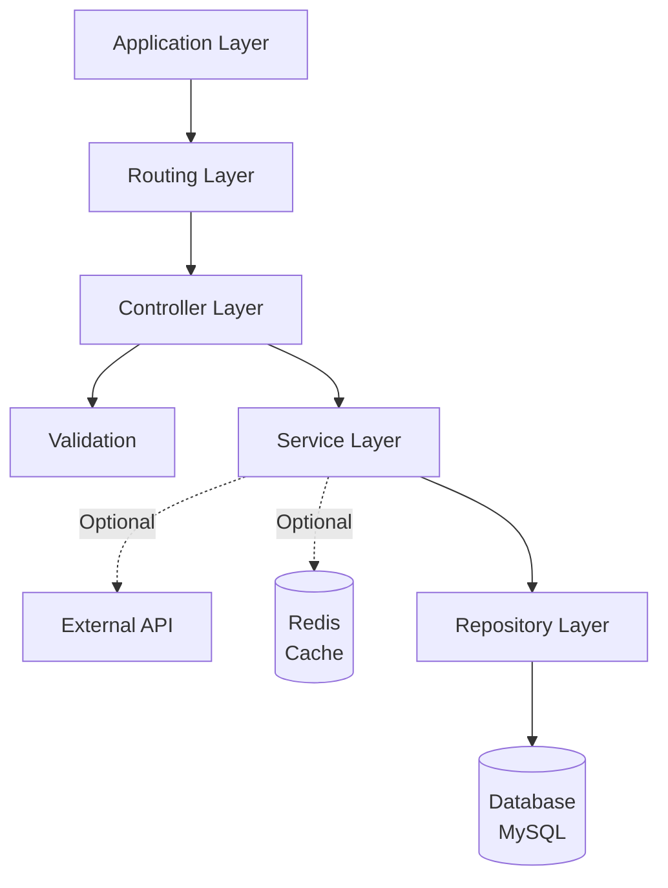
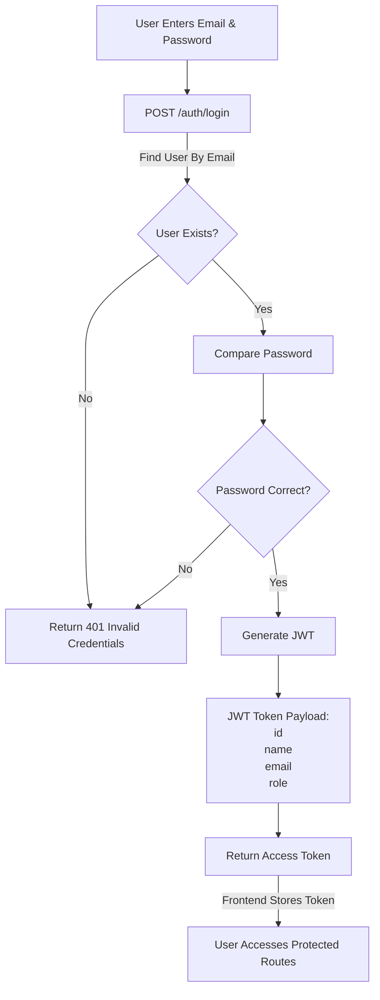
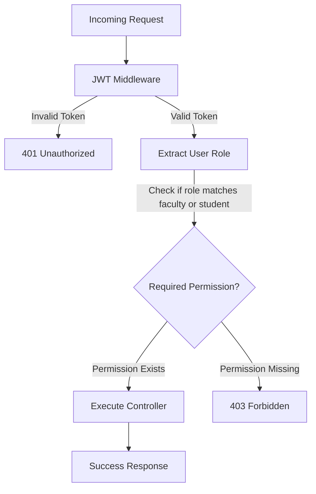

## Architecture



| Layer      | Responsibility                                 | Knows About               |
| ---------- | ---------------------------------------------- | ------------------------- |
| Application| entry point of request                         | Routing                   |
| Routing    | Define API endpoints,orchastrate middleware and delegate requests to controller| controller, middleware     |
| Controller |           HTTP request/response transformation | Service                   |
| Validation | Ensures data Integrity and Consistency in DB  |                  -                 |
| Service    | Business logic, orchestration, transactions    | Repository, External APIs |
| Repository | Data access, query building                    | Database/ORM              |


## Tech Stack
| Layer      | Tools Used                                                                      |
| ---------- | ------------------------------------------------------------------------------- |
| Application|express.js, cors, cookie-parser, dotenv                                          |
| Validation |zod                                                                              |
| Service    |bcrypt, jsonwebtoken                                                             |
| Repository |prisma(ORM), @prisma/client                                                      |

***Other Dependencies***
* **Testing:** Jest, Supertest
* **dev-dependencies:** nodemon, ESlint, globals, @prisma/client
* **api documentation:** swaggerui, swagger-jsdoc

**Programming Language**
* Node js
* MySQL


## JWT Authentication Flow



## Authentication and Authorization



## Project Folder Structure
```txt
.
├── config
│   └── app.config.js               #For configuration management
├── modules
│   ├── auth
│   │   ├── __tests__
│   │   ├── auth.controller.js
│   │   ├── auth.repository.js
│   │   ├── auth.routes.js
│   │   ├── auth.service.js
│   │   └── auth.validation.js
│   ├── faculty
│   │   ├── __tests__
│   │   ├── faculty.controller.js
│   │   ├── faculty.repository.js
│   │   ├── faculty.routes.js
│   │   ├── faculty.service.js
│   │   └── faculty.validation.js
│   └── users
│       ├── user.controller.js
│       ├── user.repository.js
│       ├── user.routes.js
│       ├── user.service.js
│       └── user.validation.js                   # Soon...
└── shared
|    ├── middleware
|    ├── types
|    └── utils
├── db.js                                         #database connection
└── index.js                                      #entry point
```

## Modules and Responsibilities
* auth - authenications and authorization(assigning roles to user based on email ID)
* app - handles submissions made by user from App and other app related routes.
* student - for viewing results, performance analytics, upcoming examinations, and submission history.
* faculty - for creating exam, exam management, reviewing results, monitoring exams, evaluation of results etc.
* user - for retrieval of user-related information.


**Github Link:** [https://github.com/RITESH-del/eval_server](https://github.com/RITESH-del/eval_server)
**Render Link:** [https://eval-server-bkzt.onrender.com](https://eval-server-bkzt.onrender.com)
